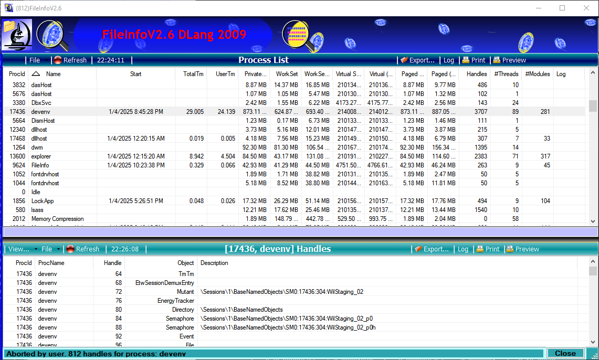
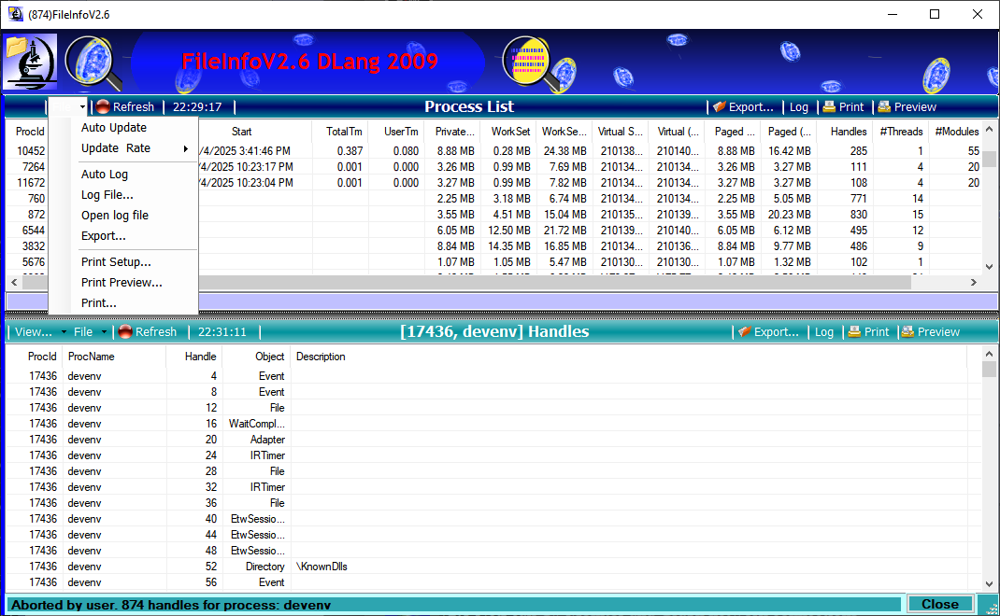
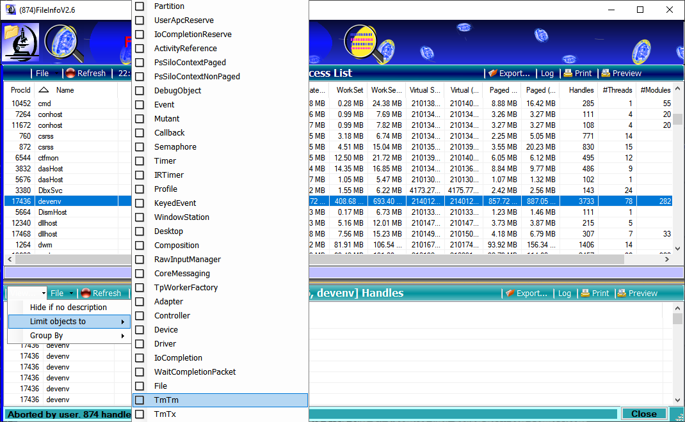
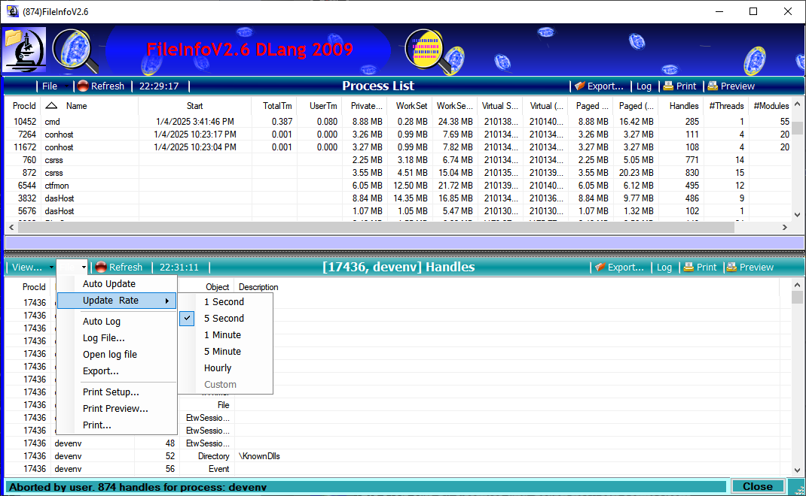

FileInfo

### Monitor running processes and list open files (Jan-2025)

This program is for demonstation purpose and a programming exercise. 

## Author / credits

Author:
  Dennis Lang 2009-2025
  https://landenlabs.com

## Description

***FileInfo*** is a C# program which monitors the active running processes.
Selecting a process row will show open file handles in the bottom panel.
This presentation and behavoir is similar to Process Explorer from System Internals.

### Sample screens

Main screen - 

Drop-down menu from top section (note the toolbar header on the top has several buttons)

Bottom handle section, filter menu (defined for Windows 10)

The following information is a partial list of some of the Window's internal 
information available for presentation. 

### DISK PERFORMANCE
-----------------

**BytesRead**  
Contains a cumulative count of bytes read from the disk since the performance counters were enabled.

**BytesWritten**  
Contains a cumulative count of bytes written to the disk since the performance counters were enabled.

**ReadTime**  
Contains a cumulative time, expressed in increments of 100 nanoseconds, spent on disk reads since the performance counters were enabled.

**WriteTime**  
Contains a cumulative time, expressed in increments of 100 nanoseconds, spent on disk reads since the performance counters were enabled.

**IdleTime**  
Contains a cumulative time, expressed in increments of 100 nanoseconds, since the performance counters were enabled in which there was no disk activity.

**ReadCount**  
Contains the number of disk accesses for reads since the performance counters were enabled.

**WriteCount**  
Contains the number of disk accesses for writes since the performance counters were enabled.

**QueueDepth**  
Contains a snapshot of the number of queued disk I/O requests at the time that the query for performance statistics was performed.

**SplitCount**  
Contains the number of disk accesses by means of an associated IRP since the performance counters were enabled.

**QueryTime**  
Contains a timestamp indicating the system time at the moment that the query took place. System time is a count of 100-nanosecond intervals since January 1, 1601. System time is typically updated approximately every ten milliseconds. For more information about system time, see KeQuerySystemTime.

**StorageDeviceNumber**  
Contains a unique number assigned to every disk or volume across a particular storage type. The storage types are disk.sys, ftdisk.sys, and dmio.sys.

**StorageManagerName**  
Contains an 8-character string that indicates which device driver provided the performance statistics. In Windows 2000, this can be either "LogiDisk" for the driver logidisk.sys or "PhysDisk" for the driver physdisk.sys. These drivers collect performance statistics for devices and physical disks respectively. In Windows XP and later operating systems, this can be any of the following three strings: "FTDISK" for the driver ftdisk.sys, "DMIO" for the driver dmio.sys, or "PARTMGR" for the driver partmgr.sys. These three drivers collect performance statistics for basic disk volumes, dynamic disk volumes, and physical disks respectively. Note that these strings are 8-character case-sensitive strings with blank fill. For example, in the case of the string "FTDISK", the StorageManagerName character array should contain two trailing blanks ("FTDISK"), and in the case of the string "DMIO", the array should contain four trailing blanks ("DMIO").

**Comments**  
Counting halts whenever the performance counters are disabled, but the counters are not reset, so the cumulative values assigned to the structure members might potentially reflect disk activity across several enablings and disablings of the counters.

* * *

[http://msdn.microsoft.com/en-us/library/ms809031.aspx](http://msdn.microsoft.com/en-us/library/ms809031.aspx)

DISK\_CACHE\_INFORMATION
------------------------

The DISK\_CACHE\_INFORMATION structure is used with the IOCTL\_DISK\_GET\_CACHE\_INFORMATION request to retrieve cache information.

    
    typedef struct _DISK_CACHE_INFORMATION {
        BOOLEAN  ParametersSavable;
        BOOLEAN  ReadCacheEnabled;
        BOOLEAN  WriteCacheEnabled;
        DISK_CACHE_RETENTION_PRIORITY  ReadRetentionPriority;
        DISK_CACHE_RETENTION_PRIORITY  WriteRetentionPriority;
        USHORT  DisablePrefetchTransferLength;
        BOOLEAN  PrefetchScalar;
        union {
            struct {
                USHORT  Minimum;
                USHORT  Maximum;
                USHORT  MaximumBlocks;
            } ScalarPrefetch;
            struct {
                USHORT  Minimum;
                USHORT  Maximum;
            } BlockPrefetch;
        };
    } DISK_CACHE_INFORMATION, *PDISK_CACHE_INFORMATION;
    

**ParametersSavable**  
Indicates, when set to 1, that the device is capable of saving any parameters in nonvolatile storage.

**ReadCacheEnabled**  
Indicates, when set to 1, that the read cache is enabled.

**WriteCacheEnabled**  
Indicates, when set to 1, that the write cache is enabled.

**ReadRetentionPriority**  
Determines the likelihood of various types of data remaining in the cache. By means of this value, for instance, data cached from a READ or WRITE operation might be given a different priority than data cached under other circumstances, such as prefetch operations. Thus a value of EqualPriority indicates that no data is held in the cache on a preferential basis. When ReadRetentionPriority is set to EqualPriority, all types of data have equal access to cache memory. On the other hand, a value of KeepPrefetchedData indicates that a preference is to be given to prefetched data while a value of KeepReadData indicates that a preference is to be given to data cached from a READ operation. For more information about the values that can be assigned to this member see the DISK\_CACHE\_RETENTION\_PRIORITY enumeration.

**WriteRetentionPriority**  
See discussion under ReadRetentionPriority.

**DisablePrefetchTransferLength**  
Disables prefetching. Prefetching might be disabled whenever the number of blocks requested exceeds the value in DisablePrefetchTransferLength. When zero, prefetching is disabled no matter what the size of the block request.

**PrefetchScalar** When TRUE, Indicates that ScalarPrefetch.Maximum should be used together with the transfer length to calculate the amount of data that can be prefetched. When FALSE, BlockPrefetch.Maximum will be the maximum number of disk blocks that can be prefetched.

**ScalarPrefetch.Minimum** Contains the scalar multiplier of the transfer length of the request when PrefetchScalar is TRUE. If PrefetchScalar is TRUE, the value in ScalarPrefetch.Minimum is multiplied by the transfer length to obtain the minimum amount of data that can be prefetched into the cache on a disk operation.

**ScalarPrefetch.Maximum** Contains the scalar multiplier of the transfer length of the request when PrefetchScalar is TRUE. If PrefetchScalar is TRUE, the value in ScalarPrefetch.Maximum is multiplied by the transfer length to obtain the maximum amount of data that can be prefetched into the cache on a disk operation.

**ScalarPrefetch.MaximumBlocks** Contains the maximum size, in blocks, of the transfer length.

**BlockPrefetch.Minimum** Indicates the minimum amount of data, as an absolute number of disk blocks, that can be prefetched into the cache on a disk operation, when PrefetchScalar is FALSE.

**BlockPrefetch.Maximum** Indicates the maximum amount of data, as an absolute number of disk blocks, that can be prefetched into the cache on a disk operation, when PrefetchScalar is FALSE.

[Top](#top)
